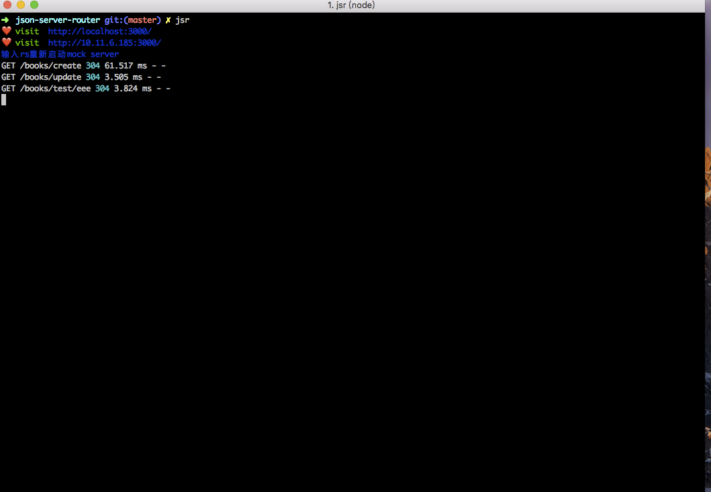
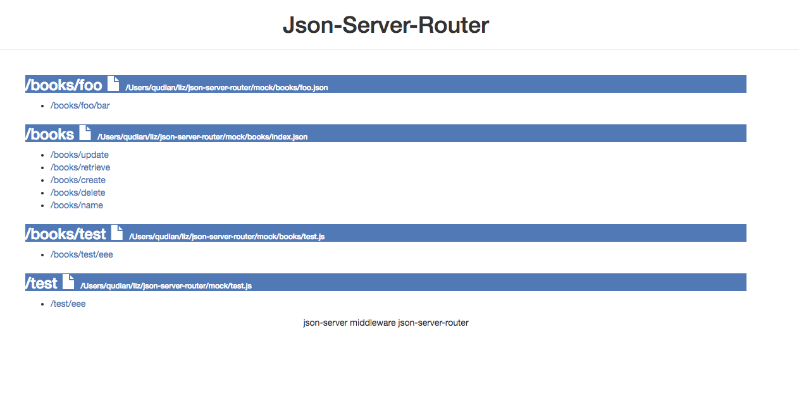

# json-server-router

[json-server-router](https://github.com/advence-liz/json-server-router)  简单且强大的 mock server

> `json-server-router`是对`json-server`的扩展所以要想更好的理解下面的内容最好要先了解[json-server](https://github.com/typicode/json-server)


## json-server-router 要解决的问题

在使用 json-server 时你写了如下文件(db.json) 也就代表你得到了四个 mock 接口
`/update` ,`/retrieve`, `/create` ,`/delete`
但是实际的需求中接口路由肯定不能这么简单你需要的可能是 `/aaa/bbb/ccc/update`这样的形式,虽然`json-server`可以配置`rewrite`可以解决部分问题，但是这并不简单，接下来我们来看一下`json-server-router`的方式

```json
// db.json
{
  "update": { "code": 200, "message": "succeed", "data": true },
  "retrieve": { "code": 200, "message": "succeed", "data": true },
  "create": { "code": 200, "message": "succeed", "data": true },
  "delete": { "code": 200, "message": "succeed", "data": true }
}
```

## json-server-router 使用方式

json-server-router 的实现理念是根据目录结构，构建出想要的接口形式
假设我们的目标接口为 `/aaa/bbb/ccc/update`
那么我们只需构件出如下的目录结构

当遇到名称为 `index` 的文件路径拼接的时候会忽略`index`，当遇见键值为 `index`路径拼接同样也会忽略`index`

```bash
- aaa
  - bbb
    + ccc.json   // 在ccc.json中添加 update
or 

- aaa
  - bbb
    - ccc
      +index.json // 在index.json中添加update

```

## 路由生成示意大概下面这个样子,`mock`为 mock 文件的根目录

```bash
mock/books/index.json
-mock
 + index.json    ------>   /xxx
 + book.json     ------>   /book/xxx
 - foo
   + index.json  ------>  /foo/xxx
   + bar.json    ------>  /foo/bar/xxx
```

## 假设`/books/index.json`内容如下  

将对应生成四个接口 `/books/` `/books/retrieve` `/books/create` `/books/delete`

```json
{
  "index": { "code": 200, "message": "succeed", "data": true }, // /books/
  "retrieve": { "code": 200, "message": "succeed", "data": true },// /books/retrieve
  "create": { "code": 200, "message": "succeed", "data": true },// /books/create
  "delete": { "code": 200, "message": "succeed", "data": true }// /books/delete
}
```

## 安装&使用

当前全局安装之后你会得到一个叫`jsr`的全局命令,根据前面的介绍这时候其实你只需构件出一个包含`mock files` 的根目录就足够了

```bash
$ npm install json-server-router -g
$ jsr --root mock
```

## 命令参数

```bash
jsr [options]

Options Required:
  --root, -r  Paths to mock files parent dir          [string] [required]

Options:
  --config           Path to JSON config file  [string] [default:jsr.config.js]
  --port, -p         Set port                    [number] [default: 3000]
  --host                                [string] [default: "local ip"]
  --static           Set static files directory(same as json-server) [string] [default: "public"]
  --watch, -w        Watch file(s)             [boolean] [default: false]
  --open, -o         open                      [boolean] [default: false]
  --middlewares, -m  Paths to middleware files TODO               [array]
  --help, -h         Show help                                  [boolean]
  --version, -v      Show version number                        [boolean]

Examples:
  jsr --root mock
  jsr --root mock --port 3000
```  

### 参数说明

- `config` 设置配置文件默认配置文件的地址是当前目录的下的`jsr.config.js`
- `static` 静态资源的地址跟`json-server`是一致的，需要注意的是如果 `static`路径存在的话`json-server-router`会自动创建一个包含所有路由的`index.html`，如果`static`目录不存在，不会自动创建目录生成`index.html`
- `watch` 监控文件变化自动重新加载

## `jsr.config.js` simple

```js
module.exports = {
  root: 'mock',
  port: 3000,
}
```

## GET

`json-server-router`其底层依赖[json-server](https://github.com/typicode/json-server)所构建，所以在不出意外的情况下同时也拥有`json-server`的所有`GET`请求相关功能

当使用`json-server` 我们可以通过构建路由`/get/users?_page=7&_limit=10`进行分页查询但是`query`的关键词必须是指定的
在`json-server-router`中可以再`jsr.config.js`中自定义`queryMap`字段来修改关键词的名字，配置好了之后就可以通过`/get/users?page=7&len=10`进行分页查询

```js
//jsr.config.js
{
  queryMap: [['_page', 'page'], ['_limit', 'len']]

}
```

## POST PUT DELETE

关于非`GET`请求你不需要定义`mock files`，`json-server-router`对所有非`GET`请求进行统一处理不管其路由是什么一致通过handler函数处理

### 返回结果如下

```js
{
    "body": {},
    "code": 200,
    "ip": "::1",
    "message": "succeed",
    "url": "/books/"
}
```

### 你可以通过重写`jsr.config.js`中的handler 函数自定义其处理结果

```js
//jsr.config.js
 {
 /**
   * 处理所有非GET请求
   * 当query fial 有值的时候认为请求设置为失败状态
   */
  handler (req, res, next) {
    const { ip, originalUrl, body } = req
    const isFail = !!req.query.fail
    res.json({
      code: isFail ? 500 : 200,
      message: isFail ? 'failed' : 'succeed',
      cookie: req.get('cookie'),
      ip,
      url: originalUrl,
      body: body
    })
  }
 }
```

## jsr魔法注释

### 有的时候你可以能需要非GET请求得到跟GET请求一样的行为

为了完成将非GET请求跟GET一致的行为,对 mock 数据添加了配置 `"list[get]"`生成的路由不会包含`[get]` 当用POST 访问 `/xxxx/list`时就会得到mock文件中定义的数据

```json
{
  "list[get]": [
    { "id": 0, "name": "book1" },
    { "id": 1, "name": "book2" },
    { "id": 2, "name": "book3" }
  ]
}
```
### 文件上传功能

jsr支持文件上传功能只要添加file注释即可`"upload[file]"`,目前上传文件对应的`name`固定为`file`

```json
{
  "upload[file]": { "code": 200, "message": "succeed", "data": true }
}
```

`/xxxx/upload`返回结果如下：

```json
{
    "code": 200,
    "files": [
        {
            "destination": "public/temp",
            "encoding": "7bit",
            "fieldname": "file",
            "filename": "0668151cf3f749154c6b1942abe38ad6",
            "mimetype": "application/javascript",
            "originalname": "jsr.config.js",
            "path": "public/temp/0668151cf3f749154c6b1942abe38ad6",
            "size": 494
        }
    ]
}
```
推一手[httpie](https://httpie.org/)：使用httpie如下命令即可完成上传文件的功能：

`$ http -f  xxxx/upload file@somefile.xx`

## tips

- 当`jsr`运行起来之后在命令窗口键入`rs`会重新加载
  
- 当`static`路径存在的时候，路由`/jsr` 会返回所有路由信息，当`static`路径不存在的时候路由`/`会返回所有路由信息

## 战斗人员可以作为`json-server`中间件引用

可以参考`cli/server.js`

```js
const jsonServer = require("json-server")
const server = jsonServer.create()
const middlewares = jsonServer.defaults() // { static: 'public' }
const JsonServerRouter = require("json-server-router")

/**
 * @prop {string} root mock文件根目录默认为 'mock'
 * @prop {number} port 端口号跟json-server 一致 默认为 3000
 * @prop {string} publicPath 生成默认首页的地址，跟json-server 配置一致 默认'public',如果修改路径的话那么json-server 对应的配置也要改
 * @prop {bool} open 是否用浏览器打开 默认 true
 */

const router = new JsonServerRouter({
  root: "mock",
  port: 3000,
  publicPath: "public"
})

server.use(middlewares)

server.use(router.routes())
server.use(router.rewrite())

server.listen(3000, () => {
  console.log("JSON Server is running")
})
```

## 演示

fork 本仓储然后`$ npm i` `npm link` `jsr` 效果将如同下面所示：




