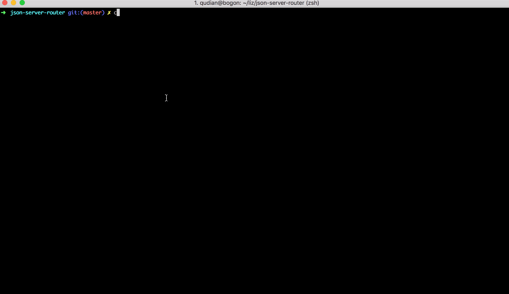

# [json-server-router](https://github.com/typicode/json-server)

json-server-router是[json-server]((https://github.com/typicode/json-server))中间件,其作用是提供一个简明的方式构建出各种路由接口

## json-server

在使用 json-server 时你写了如下文件(router.json) 也就代表你得到了四个 mock 接口
`/update` ,`/retrieve`, `/create` ,`/delete`
但是实际的需求中接口路由肯定不能这么简单你需要的可能是 `/aaa/bbb/ccc/update`这样的形式
所以 josn-server-router middleware 的目的就是提供一种简单的方式构建任意路由

```json
// router.json
{
  "update": { "code": 200, "message": "succeed", "data": true },
  "retrieve": { "code": 200, "message": "succeed", "data": true },
  "create": { "code": 200, "message": "succeed", "data": true },
  "delete": { "code": 200, "message": "succeed", "data": true }
}
```

## json-server-router 使用方式

json-server-router 的实现理念是根据目录结构，构建出想要的接口形式
假设我们的目标接口为 `/aaa/bbb/ccc/update`
那么我们只需构件出目录结构

```bash
- aaa
  - bbb
    + ccc.json   // 在ccc.json中添加 update

or

- aaa
  - bbb
    - ccc
      +index.json // 在index.json中添加update
```

简单的路由生成示意大概下面这个样子,`src`为 mock 文件的根目录

```bash
src/books/index.json
-src
 + index.json    ------>   /xxx
 + book.json     ------>   /book/xxx
 - foo
   + index.json  ------>  /foo/xxx
   + bar.json    ------>  /foo/bar/xxx
```

## 安装

```bash
$ yarn add json-server-router
```

## demo

详见`example`目录

```js
const jsonServer = require("json-server")
const server = jsonServer.create()
const middlewares = jsonServer.defaults() // { static: 'public' }
const JsonServerRouter = require("../index.js")
/**
 * @prop {string} root mock文件根目录默认为 'mock'
 * @prop {number} port 端口号跟json-server 一致 默认为 3000
 * @prop {string} publicPath 生成默认首页的地址，跟json-server 配置一致 默认'public',如果修改路径的话那么json-server 对应的配置也要改
 */

const router = new JsonServerRouter({
  root: "mock",
  port: 3000,
  publicPath: "public"
})

server.use(middlewares)

server.use(router.routes())

server.listen(3000, () => {
  console.log("JSON Server is running")
})
```

## 演示



## 已知问题

- 如果当前`publicPath`对应的目录不存在，虽然运行`json-server-router`会自动生成目录但是此时默认打开的首页还是`json-server`的默认主页，而不是`json-server-router`生成的首页不过接口依然是有效的,解决方案就是再运行一遍